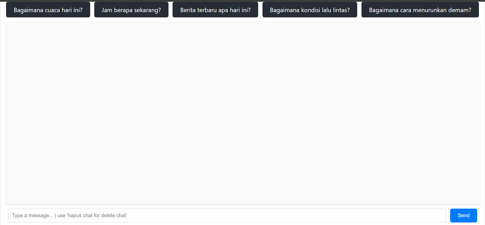
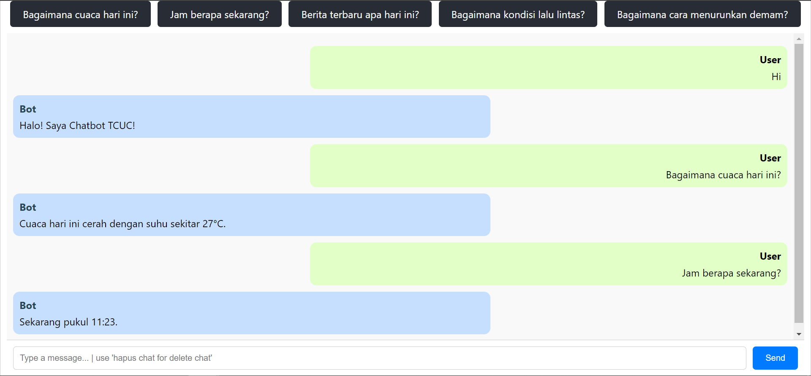
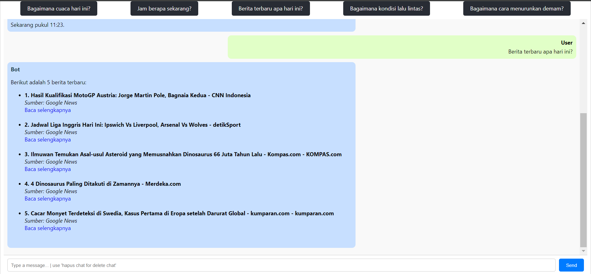
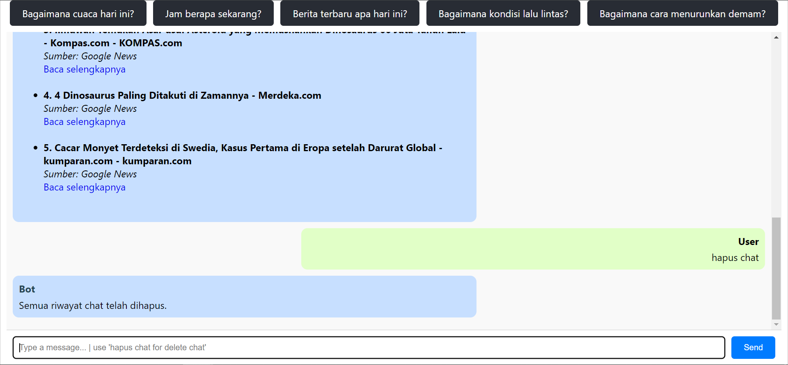
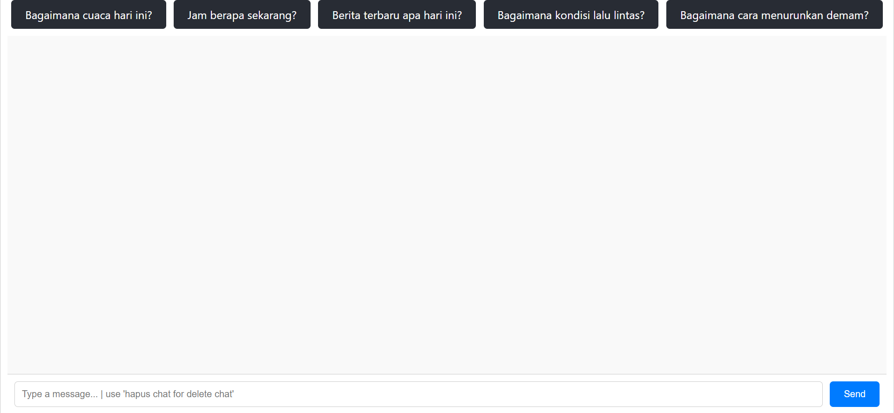

# Chatbot TCUC

## Project Overview

Chatbot TCUC is a conversational AI chatbot designed to assist users by answering simple questions and providing the latest news updates. It integrates with a public news API to fetch real-time news and is capable of understanding and responding to various user inquiries.

## Technologies Used

- **Frontend**: React.js
- **Backend**: Laravel (PHP Framework)
- **Database**: MySQL
- **APIs**: [News API](https://newsapi.org/)
- **Libraries**:
  - BotMan (PHP chatbot framework)
  - Axios (For handling HTTP requests in React.js)
  - Laravel HTTP Client (For making API requests)

## Features Implemented

- **Greeting & Simple Responses**: The bot can respond to greetings like "Hi" or "Hello" and provide the current time, date, weather, and more.
- **News Fetching**: Users can type "news" or "berita" to receive the latest 5 news articles from the News API, complete with titles, sources, and links.
- **Chat History Management**: Users can type "hapus chat" to clear the chat history.
- **Recommended Questions**: The bot interface displays recommended questions that users can click to quickly get responses.
- **Session Persistence**: Chat history is loaded upon refreshing the page.

## Getting Started

### Prerequisites

- **Node.js**: Ensure you have Node.js installed.
- **Composer**: PHP package manager.
- **MySQL**: Ensure you have MySQL installed and running.

### Installation

1. **Clone the repository**:
   ```bash
   git clone https://github.com/thec41n/chatbot-tcuc.git
   cd chatbot-tcuc
   ```
2. **Backend Setup (Laravel)**:
   Navigate to the backend directory:
   ```bash
   cd backend
   composer install
   cp .env.example .env
   php artisan key:generate
   ```
3. **Frontend Setup (Laravel)**:
   Navigate to the backend directory:
   ```bash
   cd ../frontend
   npm install
   ```
4. **Configure environment variables**:
   ```bash
   DB_DATABASE=chatbot_db
   DB_USERNAME=root
   DB_PASSWORD=
   NEWS_API_KEY=your_newsapi_key
   ```
5. **Start the development servers**:
   Backend:
   ```bash
   cd backend
   php artisan serve
   ```
   Make sure to activate MySQL Server
   Frontend:
   ```bash
   cd frontend
   npm start
   ```
6. **Access the application**:
   Open your browser and navigate to `http://localhost:3000` to interact with the chatbot.

### Usage

- **Greeting**: Type "Hi" or "Hello" to start the conversation.
- **Get News**: Type "news" or "berita" to fetch the latest headlines.
- **Ask Questions**: You can ask questions like "Jam berapa sekarang?" or "Hari apa sekarang?".
- **Delete Chat**: Type "hapus chat" to delete the chat history.

### Recommended Questions

The chatbot interface includes recommended questions that users can click on to quickly interact with the bot

### Screenshots

<table>
  <tr>
    <td>
      <a href="./assets/Home.png" target="_blank">
        
      </a>
    </td>
    <td>
      <a href="./assets/Chat1.png" target="_blank">
        
      </a>
    </td>
  </tr>
  <tr>
    <td>
      <a href="./assets/Chat2.png" target="_blank">
        
      </a>
    </td>
    <td>
      <a href="./assets/Chat3.png" target="_blank">
        
      </a>
    </td>
  </tr>
  <tr>
    <td colspan="2" align="center">
      <a href="./assets/Chat4.png" target="_blank">
        
      </a>
    </td>
  </tr>
</table>